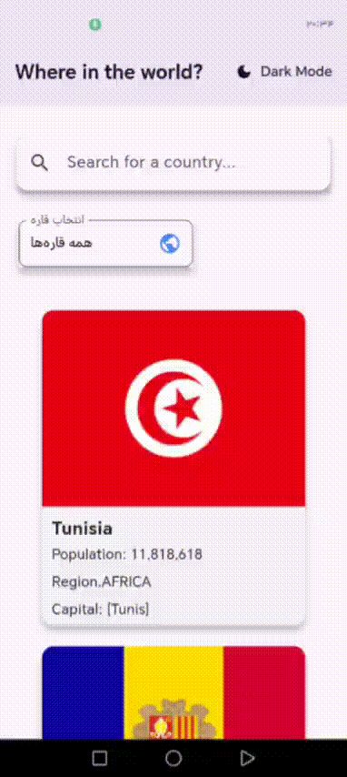
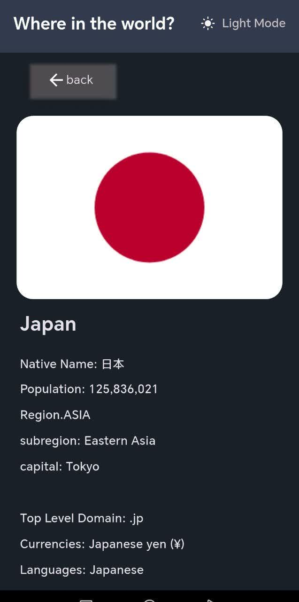

# 🌍 Country Explorer

A Flutter mobile application to explore countries and view detailed information.  
Built with **GetX** for state management, **http** for API calls, and smooth **Hero Animations** for transitions.  

---

## ✨ Features
- Fetch list of countries from a public API
- Display country name, flag, and detailed information
- **GetX** for state management and routing
- **http** package for API integration
- Smooth page transitions with **Hero Animations**
- Simple, responsive UI

---

## 📱 Screenshots
| Screenshots  | Screenshots  |
|--------------|-----------------|
|  |  |

---

## 🛠 Tech Stack
- [Flutter](https://flutter.dev/)  
- [GetX](https://pub.dev/packages/get)  
- [http](https://pub.dev/packages/http)  
- Hero Animations  

